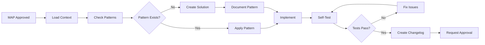

# Birthday Website Workflow Orchestration

## Context Summary

**Purpose**: Defines all workflows, processes, and orchestration patterns for development, documentation, and deployment of the birthday website.

**Key Information**:

- Sequential workflow: Epic → Story → Sub-task → Implementation → Approval
- Human approval required between all major stages
- MAP documentation for task specification
- Changelog tracking with CHL-YYMMDDHHMM format

**When to Use**: Reference when creating MAP documents, implementing features, managing documentation, or following development workflows.

---

## System Layer (Workflow Philosophy)

### Core Workflow Principles

1. **Risk-Based Process**: Documentation depth matches task complexity
2. **Selective Approval Gates**: Only high-impact changes need pre-approval
3. **Implementation First**: For simple tasks, document after shipping
4. **Verification Required**: Test before deployment
5. **Meaningful Changelog**: Document changes that matter to users

### Workflow Hierarchy

```
Epic (Major Feature)
  └── Story (User-Facing Capability)
      └── Sub-task (Implementation Unit)
          └── Implementation (Code)
              └── Verification (Testing)
                  └── Approval (Human Gate)
```

### Decision Authority

- **Technical Decisions**: ADL (Architecture Decision Log) is authoritative
- **Design Decisions**: CORE-SYSTEM.md is authoritative  
- **Implementation Patterns**: IMPLEMENTATION-PATTERNS.md is authoritative
- **Process Decisions**: This document is authoritative

## When NOT to Follow These Workflows

- **Tasks under 30 minutes** - Just implement and ship
- **Emergency fixes** - Fix immediately, document after
- **Framework updates** - Adapt to new best practices
- **Prototypes** - Explore without process overhead
- **User-requested changes** - Respond to feedback quickly
- **Refactoring for clarity** - Improve code without ceremony

---

## Task Layer (Workflow Specifications)

## Documentation Requirements by Task Type

| Task Complexity         | Documentation     | Approval      | When to Use Full MAP      |
| ----------------------- | ----------------- | ------------- | ------------------------- |
| Trivial (typos, colors) | Changelog only    | None          | Never                     |
| Simple (bug fixes)      | Brief description | Post-facto    | Never                     |
| Moderate (new features) | Requirements list | Before deploy | If >5000 tokens needed    |
| Complex (architecture)  | Full MAP          | Before start  | Always                    |
| Large (multi-part)      | Full MAP          | Before start  | To manage context windows |

## When to Skip This Workflow

- Emergency production fixes
- Prototypes and experiments
- Changes already covered by existing patterns in implementation-patterns.md
- When following framework conventions from routing-guide.md
- Tasks under 30 minutes of implementation time

### MAP Document Creation Workflow (For Complex Tasks Only)

#### MAP Document Structure

```markdown
---
title: [Descriptive Task Title]
type: MAP
priority: [P0|P1|P2]
status: [Draft|In Progress|Complete]
human_required: [true|false]
created: YYYY-MM-DD
updated: YYYY-MM-DD
dependencies: ['dependency-1', 'dependency-2']
affects_systems: ['system-1', 'system-2']
character_count: [actual count]
---

# [Task Title]

## Context Summary

**Purpose**: [Core objective in 1-2 sentences]
**Key Requirements**: [3-5 critical specifications]
**Dependencies**: [Technical or process prerequisites]
**Impact**: [What this enables or affects]

## Related Documents

**Prerequisites**: [Documents that must be read first]
**See Also**: [Supporting references]
**Enables**: [What this unlocks]

## Technical Specifications

### [Specification Category]

- [ ] Specific requirement with measurable outcome
- [ ] Another requirement with clear acceptance criteria

## Tech Stack References

[Reference approved stack from CORE-SYSTEM.md]

## Acceptance Criteria

### Verification Process

1. **[Test Category]**:
   - [ ] Specific test with expected result
   - [ ] Another test with clear pass/fail

## Implementation Notes

[Any specific constraints or considerations]

**END OF DOCUMENT**
```

#### Simplified MAP Process (Complex Tasks)

1. **Assess Complexity** → Only use MAP for multi-part or high-risk tasks
2. **Define Scope** → List what will and won't be included
3. **Set Success Criteria** → How to know when done
4. **Break Down If Needed** → Split into manageable chunks for context windows
5. **Get Approval If Critical** → Only for architecture changes or breaking changes

### Implementation Workflow

#### Pre-Implementation Checklist

```typescript
interface PreImplementationCheck {
  mapDocumentExists: boolean; // MAP file created
  dependenciesSatisfied: boolean; // Previous tasks complete
  techStackApproved: boolean; // Using ADL-approved tech
  patternsIdentified: boolean; // Checked IMPLEMENTATION-PATTERNS
  acceptanceCriteriaClear: boolean; // Know how to verify
}

// All must be true before starting implementation
```

#### Implementation Process



#### Post-Implementation Requirements

1. **Verification Complete** → All acceptance criteria met
2. **Tests Passing** → Automated and manual tests
3. **Changelog Created** → CHL-YYMMDDHHMM file
4. **Documentation Updated** → If new patterns created
5. **Human Approval** → Explicit confirmation received

### Documentation Workflow

#### Documentation Standards

```yaml
# Required for all documentation
metadata:
  title: [Clear, descriptive title]
  type: [DOC|MAP|CHL|ADR|RFC]
  priority: [P0|P1|P2]
  status: [Draft|Active|Approved|Deprecated]
  character_count: [max 10, 000]

structure:
  - Context Summary (required)
  - Main Content (organized by layers if applicable)
  - END OF DOCUMENT marker (required)

quality:
  - Every sentence adds unique value
  - No redundancy between documents
  - Clear cross-references
  - Actionable guidance
```

#### Documentation Creation Process

1. **Write Content** → Focus on unique value
2. **Apply Structure** → Follow templates
3. **Add Metadata** → Complete all fields
4. **Audit Length** → Under 10,000 characters
5. **Cross-Reference** → Link related docs
6. **Mark Complete** → Add END OF DOCUMENT

### Changelog Workflow

#### Changelog File Naming

```bash
# Format: CHL-YYMMDDHHMM-five-word-description.md
CHL-2501101430-add-rsvp-form-component.md
CHL-2501111000-update-color-system-tokens.md
CHL-2501120900-fix-auth-redirect-issue.md

# Organization
.meatware/paperwork/CHL-changelog/
  ├── CHANGELOG.md          # Index file only
  ├── CHL-2501/            # January 2025
  │   ├── CHL-250110*.md
  │   └── CHL-250115*.md
  └── CHL-2502/            # February 2025
      └── CHL-250201*.md
```

#### Changelog Entry Structure

```markdown
---
title: [Change Description]
version: [semantic version if applicable]
type: CHL
impact: [Critical|High|Medium|Low]
git_comment: 'feat(scope): description'
---

# [Change Title]

## Context Summary

**Change Type**: [Feature|Fix|Refactor|Docs|Style|Test]
**Affected Systems**: [List of impacted areas]
**Breaking Changes**: [Yes/No - details if yes]

## Added

- New functionality or features

## Changed

- Modifications to existing features

## Fixed

- Bug fixes and corrections

## Technical Debt

- Acknowledged debt or temporary solutions
- Items for future refactoring

## Migration Notes

[If breaking changes, how to migrate]

**END OF DOCUMENT**
```

---

## Interaction Layer (Workflow Connections)

### Task Flow Architecture

```
User Story Definition
    ↓
MAP Document Creation → Human Review → Approved/Rejected
    ↓ (if approved)
Implementation Start → Pattern Check → Coding
    ↓
Testing → Self-Verification → All Tests Pass
    ↓
Changelog Entry → Documentation Update
    ↓
Human Review → Approved/Rejected
    ↓ (if approved)
Deployment → Monitoring
    ↓
Next Sub-task (repeat)
```

### Approval Gate Process

```typescript
interface ApprovalGate {
  stage: 'map' | 'implementation' | 'deployment';
  requester: string;
  timestamp: Date;
  checklist: {
    requirementsMet: boolean;
    testsPass: boolean;
    documentationComplete: boolean;
    changelogCreated: boolean;
  };
  approver?: string;
  approvalTimestamp?: Date;
  comments?: string;
}

// No progression without approval
if (!approvalGate.approver) {
  throw new Error('Human approval required to proceed');
}
```

### Communication Patterns

#### Requesting Approval

```markdown
## Approval Request: [Task Name]

**Stage**: [MAP Review | Implementation Review | Deployment]
**Completed Checklist**:

- ✅ All requirements addressed
- ✅ Tests passing (link to results)
- ✅ Documentation updated
- ✅ Changelog entry created: CHL-[timestamp]

**Summary of Changes**:
[Brief description of what was done]

**Verification Evidence**:
[Screenshots, test outputs, or other proof]

**Requesting approval to proceed to**: [next stage]
```

#### Providing Feedback

```markdown
## Review Feedback: [Task Name]

**Status**: [Approved ✅ | Changes Requested 🔄]

**If Approved**:

- Proceed to [next stage]
- Update MAP status to [new status]

**If Changes Requested**:

- [ ] Issue 1: [Description and required fix]
- [ ] Issue 2: [Description and required fix]
- Resubmit for approval after addressing
```

---

## Response Layer (Verification & Quality Gates)

### Verification Checklists

#### MAP Document Verification

- [ ] ✅ Follows exact template structure
- [ ] ✅ All metadata fields complete
- [ ] ✅ Requirements use checkbox format
- [ ] ✅ Acceptance criteria specific and measurable
- [ ] ✅ Dependencies explicitly listed
- [ ] ✅ Character count under 10,000
- [ ] ✅ END OF DOCUMENT marker present

#### Implementation Verification

- [ ] ✅ All MAP requirements addressed
- [ ] ✅ Follows patterns from IMPLEMENTATION-PATTERNS.md
- [ ] ✅ Uses approved tech stack only
- [ ] ✅ TypeScript strict mode passes
- [ ] ✅ No console errors
- [ ] ✅ Accessibility standards met
- [ ] ✅ Mobile responsive
- [ ] ✅ Loading states implemented
- [ ] ✅ Error handling complete

#### Deployment Verification

- [ ] ✅ Build successful
- [ ] ✅ All tests passing
- [ ] ✅ Environment variables configured
- [ ] ✅ Database migrations reviewed
- [ ] ✅ Changelog entry created
- [ ] ✅ Documentation current
- [ ] ✅ Human approval received

### Quality Metrics

#### Code Quality Metrics

```typescript
interface QualityMetrics {
  typeScriptCoverage: number; // Target: 100%
  testCoverage: number; // Target: 80%
  accessibilityScore: number; // Target: 100
  performanceScore: number; // Target: 90+
  buildTime: number; // Target: < 60s
  bundleSize: number; // Target: < 200KB
}
```

#### Process Quality Metrics

```typescript
interface ProcessMetrics {
  mapToImplementationTime: number; // Target: < 4 hours
  implementationToApprovalTime: number; // Target: < 2 hours
  rejectionRate: number; // Target: < 20%
  reworkRate: number; // Target: < 10%
  documentationCompleteness: number; // Target: 100%
}
```

### Escalation Procedures

#### When to Escalate

1. **Blocked by Dependencies** → Missing prerequisite work
2. **Technical Limitation** → ADL doesn't cover scenario
3. **Requirement Unclear** → MAP needs clarification
4. **Pattern Missing** → No existing solution pattern
5. **Tests Failing** → Cannot resolve after 3 attempts

#### Escalation Process

```markdown
## Escalation: [Issue Title]

**Blocking Task**: [MAP or implementation reference]
**Issue Type**: [Dependency|Technical|Requirement|Pattern|Testing]

**Problem Description**:
[Clear description of the blocker]

**Attempted Solutions**:

1. [What was tried]
2. [What else was tried]

**Requested Action**:
[What decision or clarification needed]

**Impact if Unresolved**:
[Timeline and downstream effects]
```

---

## Workflow Quick Reference

### Decision Tree for Task Execution

```
Task Assigned
├── Is it documented in MAP?
│   ├── No → Create MAP → Request Approval
│   └── Yes → Continue
├── Are dependencies complete?
│   ├── No → Wait or escalate
│   └── Yes → Continue
├── Does pattern exist?
│   ├── Yes → Apply pattern
│   └── No → Check shadcn/ui → Compose → Create custom
├── Implementation complete?
│   └── Run verification checklist
├── All tests pass?
│   ├── No → Fix and retest
│   └── Yes → Create changelog
└── Request approval → Wait → Proceed or rework
```

### Common Workflows

#### New Feature Workflow

1. Epic defined → Break into stories
2. Story defined → Create sub-task MAPs
3. MAP approved → Begin implementation
4. Pattern research → Apply or create
5. Code complete → Test thoroughly
6. Tests pass → Document changes
7. Changelog created → Request approval
8. Approved → Deploy to staging
9. Staging verified → Deploy to production
10. Update status → Move to next task

#### Bug Fix Workflow

1. Bug reported → Verify reproduction
2. Create fix MAP → Define acceptance criteria
3. MAP approved → Investigate root cause
4. Fix implemented → Test fix
5. Regression tested → Verify no breaks
6. Changelog created → Request approval
7. Approved → Deploy fix
8. Verify in production → Close issue

#### Documentation Update Workflow

1. Need identified → Check existing docs
2. Update or create → Follow templates
3. Metadata complete → Under character limit
4. Cross-references → Updated
5. Review complete → Request approval
6. Approved → Publish
7. Index updated → Notify team

---

## Automation Helpers

### Validation Scripts

```bash
#!/bin/bash
# validate-map.sh
echo "Validating MAP document..."
check_metadata() { grep -q "^type: MAP" "$1"; }
check_requirements() { grep -q "\- \[ \]" "$1"; }
check_character_count() { wc -c "$1" | awk '{print $1 < 10000}'; }
check_end_marker() { grep -q "END OF DOCUMENT" "$1"; }

# validate-implementation.sh
echo "Validating implementation..."
npm run type-check || exit 1
npm run lint || exit 1
npm run test || exit 1
npm run build || exit 1
echo "✅ All checks passed"
```

### Changelog Generator

```typescript
// generate-changelog.ts
function generateChangelog(change: ChangeInfo): string {
  const timestamp = format(new Date(), 'yyMMddHHmm');
  const filename = `CHL-${timestamp}-${change.summary}.md`;

  return `---
title: ${change.title}
type: CHL
impact: ${change.impact}
git_comment: "${change.gitComment}"
---

# ${change.title}

## Context Summary
**Change Type**: ${change.type}
**Affected Systems**: ${change.systems.join(', ')}
**Breaking Changes**: ${change.breaking ? 'Yes' : 'No'}

${change.content}

**END OF DOCUMENT**`;
}
```

---

**END OF DOCUMENT**
