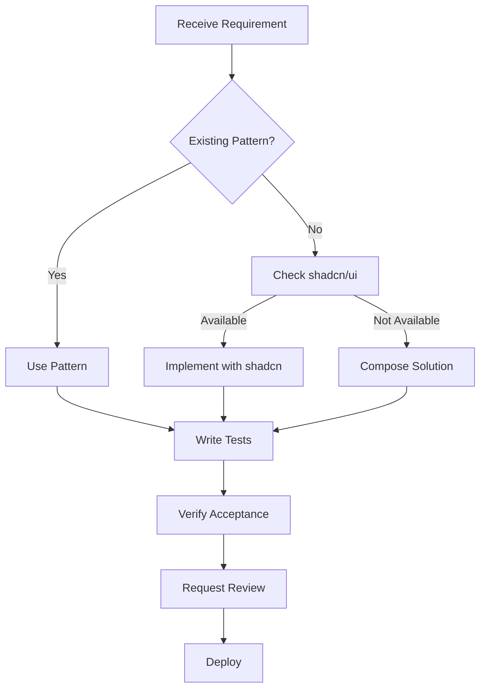

# Birthday Website Implementation Patterns

## Context Summary

**Purpose**: Comprehensive patterns and guidelines for implementing features in the birthday website, including naming conventions, code organization, and development workflows.

**Key Information**:

- Component development priority: shadcn/ui → Compose → Extend → Custom
- Naming patterns: PascalCase components, camelCase utilities, kebab-case folders
- Testing-first approach with TypeScript strict mode
- Structured patterns for common implementations

**When to Use**: Reference when implementing any feature, creating new components, or establishing code patterns.

---

## Pattern Selection Matrix

| Scenario      | Use Existing Pattern | Create New Pattern     | Ignore Patterns   |
| ------------- | -------------------- | ---------------------- | ----------------- |
| Common task   | ✅ Always            | ❌ Never               | ❌ Never          |
| Similar task  | ✅ Adapt if possible | ⚠️ If adaptation fails | ❌ Never          |
| Novel task    | ❌ N/A               | ✅ Document after      | ⚠️ For prototypes |
| Emergency fix | ✅ If available      | ❌ Never               | ✅ If needed      |

## When NOT to Follow These Patterns

- **Prototyping**: Ignore patterns to explore ideas quickly
- **Third-party Libraries**: Their conventions may override ours
- **Emergency Fixes**: Fix first, refactor to patterns later
- **One-off Scripts**: Don't over-engineer temporary code
- **External APIs**: Match their naming conventions in integration layers

## System Layer (Development Philosophy)

### Core Development Principles

1. **Leverage Existing Solutions**: Never build what already exists
2. **Component-First Architecture**: Think in reusable components
3. **Type Safety Throughout**: TypeScript strict mode, no any types
4. **Test Immediately**: Verify as you build, not after
5. **Document Decisions**: ADR for why, comments for complex logic

### Implementation Priority Order

```
1. Check shadcn/ui catalog → Use if available
2. Compose existing components → Combine for new functionality
3. Extend with animations → Add Framer Motion to existing
4. Build custom (requires justification) → Document why needed
```

### Quality Standards

- **TypeScript**: Strict mode, explicit types, no implicit any
- **Accessibility**: WCAG 2.1 AA minimum
- **Performance**: Lazy load, code split, optimize images
- **Error Handling**: Every async operation, user-friendly messages
- **Loading States**: Skeleton screens, progress indicators

---

## Task Layer (Implementation Specifications)

### Naming Conventions

#### File & Directory Naming

```typescript
// Directories: kebab-case
/user-authentication
/idea-lifecycle
/graveyard-memorial

// React Components: PascalCase.tsx
UserAuthForm.tsx
IdeaLifecycleCard.tsx
GraveyardMemorial.tsx

// Hooks: use prefix, camelCase
useAuth.ts
useIdeaManagement.ts
useToast.ts

// Utilities: descriptive camelCase
formatTimeRemaining.ts
validateRsvpForm.ts
generateConfirmationCode.ts

// Types: PascalCase.ts
User.ts
IdeaSchema.ts
RsvpFormData.ts

// API Routes: kebab-case
/api/auth/login/route.ts
/api/rsvp/submit/route.ts
```

#### Variable & Function Patterns

```typescript
// Variables: Descriptive nouns
const userAuthenticationToken = "..."
const ideaSubmissionData = {...}
const graveyardEntries = [...]

// Functions: Verb-noun pattern
function validateIdeaForm(data: IdeaFormData): ValidationResult
async function authenticateUser(credentials: Credentials): Promise<User>
function calculateTimeRemaining(targetDate: Date): TimeRemaining

// Booleans: is/has/can prefix
const isUserAuthenticated = true
const hasValidSubscription = false
const canEditIdea = true

// Event Handlers: handle prefix
const handleIdeaSubmission = (data: IdeaFormData) => {...}
const handleAuthenticationError = (error: AuthError) => {...}

// Constants: UPPER_SNAKE_CASE
const MAX_IDEA_LENGTH = 500
const DEFAULT_TIMEOUT_MS = 3000
const ANIMATION_DURATION = 200
```

### Component Patterns

#### Base Component Structure

```typescript
// UserProfileCard.tsx
import { cn } from "@/lib/utils"
import { cva, type VariantProps } from "class-variance-authority"

const profileCardVariants = cva(
  "rounded-lg border transition-all duration-200",
  {
    variants: {
      variant: {
        default: "bg-card text-card-foreground border-border",
        elevated: "bg-card shadow-lg hover:shadow-xl",
        interactive: "hover:scale-[1.02] cursor-pointer"
      },
      size: {
        sm: "p-4",
        md: "p-6",
        lg: "p-8"
      }
    },
    defaultVariants: {
      variant: "default",
      size: "md"
    }
  }
)

interface UserProfileCardProps
  extends React.HTMLAttributes<HTMLDivElement>,
  VariantProps<typeof profileCardVariants> {
  user: User
  onEdit?: () => void
}

export function UserProfileCard({
  user,
  onEdit,
  variant,
  size,
  className,
  ...props
}: UserProfileCardProps) {
  return (
    <div
      className={cn(profileCardVariants({ variant, size }), className)}
      {...props}
    >
      {/* Component content */}
    </div>
  )
}
```

#### Form Pattern with Validation

```typescript
// RSVPForm.tsx
"use client"

import { useForm } from "react-hook-form"
import { zodResolver } from "@hookform/resolvers/zod"
import * as z from "zod"

const rsvpSchema = z.object({
  name: z.string().min(2, "Name must be at least 2 characters"),
  email: z.string().email("Invalid email address"),
  attending: z.boolean(),
  dietaryRequirements: z.string().optional(),
  plusOne: z.boolean().default(false)
})

type RSVPFormData = z.infer<typeof rsvpSchema>

export function RSVPForm() {
  const form = useForm<RSVPFormData>({
    resolver: zodResolver(rsvpSchema),
    defaultValues: {
      attending: true,
      plusOne: false
    }
  })

  async function onSubmit(data: RSVPFormData) {
    try {
      // Show loading state
      // Submit to server action
      // Handle success
    } catch (error) {
      // Handle error with toast
    }
  }

  return (
    <Form {...form}>
      {/* Form fields */}
    </Form>
  )
}
```

### Tailwind Extension Pattern

When customizing design tokens in Tailwind v4:

1. **Use `@theme` to override Tailwind's existing tokens**
2. **Never create utilities that duplicate Tailwind functionality**
3. **Keep semantic utilities that provide meaningful abstraction**

#### Correct Approach

```css
/* ✅ CORRECT - Override Tailwind's defaults */
@theme {
  /* This makes .text-sm use YOUR size */
  --font-size-sm: 0.875rem;
  --font-size-base: 1rem;

  /* This makes .font-sans use YOUR font */
  --font-family-sans: 'Roboto', sans-serif;
}

/* ✅ CORRECT - Semantic utilities are good */
@layer utilities {
  .font-heading {
    font-family: 'Lora', serif;
  }
  .font-body {
    font-family: 'Roboto', sans-serif;
  }
}
```

#### Anti-Pattern to Avoid

```css
/* ❌ WRONG - Duplicating existing Tailwind utility */
.text-small {
  font-size: 0.875rem; /* Don't do this! Use @theme to make .text-sm this size */
}

/* ❌ WRONG - Creating variations of existing utilities */
.text-body {
  font-size: 1rem; /* Don't do this! Use @theme to make .text-base this size */
}
```

#### Usage in Components

```tsx
// ✅ CORRECT - Combines Tailwind sizing with semantic font
<h1 className="font-heading text-5xl font-bold">
<p className="font-body text-base text-muted-foreground">

// ❌ WRONG - Using custom utilities that duplicate Tailwind
<h1 className="font-heading text-h1">
<p className="text-body text-muted-foreground">
```

### State Management Patterns

#### Server State Priority

```typescript
// Prefer server state over client state
// ❌ Avoid
const [users, setUsers] = useState<User[]>([]);
useEffect(() => {
  fetchUsers().then(setUsers);
}, []);

// ✅ Prefer
// In page.tsx (server component)
const users = await prisma.user.findMany();

// Or with server action
async function getUsers() {
  'use server';
  return await prisma.user.findMany();
}
```

#### Client State When Necessary

```typescript
// Use client state for UI-only concerns
function IdeaCard() {
  const [isExpanded, setIsExpanded] = useState(false)
  const [isAnimating, setIsAnimating] = useState(false)

  // UI state that doesn't need persistence
  return (
    <motion.div
      animate={{ height: isExpanded ? "auto" : "200px" }}
      onAnimationStart={() => setIsAnimating(true)}
      onAnimationComplete={() => setIsAnimating(false)}
    />
  )
}
```

### Database Patterns

#### Prisma Schema Patterns

```prisma
model Rsvp {
  id        String   @id @default(cuid())
  email     String   @unique
  name      String
  attending Boolean
  plusOne   Boolean  @default(false)
  dietary   String?
  message   String?  @db.Text

  createdAt DateTime @default(now())
  updatedAt DateTime @updatedAt

  @@index([email])
  @@index([createdAt])
}
```

#### Query Patterns

```typescript
// Always use Prisma, never raw SQL
// Include error handling
// Return typed data

export async function getRsvps(): Promise<Rsvp[]> {
  try {
    return await prisma.rsvp.findMany({
      orderBy: { createdAt: 'desc' },
      select: {
        id: true,
        name: true,
        email: true,
        attending: true,
        plusOne: true,
        createdAt: true,
      },
    });
  } catch (error) {
    console.error('Failed to fetch RSVPs:', error);
    throw new Error('Could not load RSVPs');
  }
}
```

---

## Interaction Layer (Development Workflow)

### Feature Implementation Flow



### Component Development Workflow

1. **Start with Interface**

   ```typescript
   // Define props and types first
   interface ComponentProps {
     // Required props
     // Optional props with defaults
     // Event handlers
     // Variant props
   }
   ```

2. **Implement with Patterns**
   - Use CVA for variants
   - Apply semantic colors only
   - Include error boundaries
   - Add loading states

3. **Test Immediately**
   - Render test
   - User interaction test
   - Accessibility test
   - Error state test

4. **Document Usage**
   ```typescript
   /**
    * UserAuthForm - Handles user authentication
    * @example
    * <UserAuthForm
    *   onSuccess={(user) => router.push('/dashboard')}
    *   onError={(error) => toast.error(error.message)}
    * />
    */
   ```

### Error Handling Patterns

#### User-Facing Errors

```typescript
// Always provide actionable error messages
try {
  await submitRsvp(data);
  toast.success('RSVP submitted successfully!');
} catch (error) {
  if (error instanceof ValidationError) {
    toast.error('Please check your information and try again');
  } else if (error instanceof NetworkError) {
    toast.error('Connection issue. Please try again.');
  } else {
    toast.error('Something went wrong. Please contact support.');
  }

  // Log for debugging
  console.error('[RSVP Submit Error]:', error);
}
```

#### Component Error Boundaries

```typescript
export function IdeaSection({ children }: { children: React.ReactNode }) {
  return (
    <ErrorBoundary
      fallback={
        <Card className="p-6 text-center">
          <p className="text-muted-foreground">
            Unable to load ideas. Please refresh the page.
          </p>
          <Button onClick={() => window.location.reload()}>
            Refresh Page
          </Button>
        </Card>
      }
    >
      {children}
    </ErrorBoundary>
  )
}
```

---

## Response Layer (Validation & Testing)

### Component Validation Checklist

```typescript
// For every component, verify:
const componentChecklist = {
  styling: {
    semanticColors: true, // Only semantic tokens
    noInlineStyles: true, // No style prop
    responsiveDesign: true, // Works on mobile
    darkModeSupport: true, // If applicable
  },
  functionality: {
    errorHandling: true, // Try-catch blocks
    loadingStates: true, // Skeleton/spinner
    emptyStates: true, // No data handling
    accessibility: true, // ARIA labels, keyboard nav
  },
  performance: {
    lazyLoading: true, // Dynamic imports
    memoization: true, // useMemo/useCallback
    imageOptimization: true, // Next/Image usage
  },
  testing: {
    unitTests: true, // Component logic
    integrationTests: true, // User flows
    accessibilityTests: true, // Screen reader
  },
};
```

### Code Quality Gates

```bash
# Before committing any code:
npm run type-check    # TypeScript validation
npm run lint          # ESLint rules
npm run test          # Jest tests
npm run build         # Build verification
```

### Pattern Compliance Validation

```typescript
// Automated checks for pattern compliance
function validateComponent(component: ComponentFile): ValidationResult {
  const checks = {
    hasProperNaming: /^[A-Z][A-Za-z]+\.tsx$/.test(component.name),
    usesSemanticColors: !component.includes('#') && !component.includes('rgb('),
    hasVariants: component.includes('cva('),
    hasErrorHandling: component.includes('try') && component.includes('catch'),
    hasLoadingState:
      component.includes('loading') || component.includes('pending'),
    exportsDefault:
      component.includes('export default') ||
      component.includes('export function'),
  };

  return {
    passed: Object.values(checks).every(Boolean),
    failures: Object.entries(checks)
      .filter(([_, passed]) => !passed)
      .map(([check]) => check),
  };
}
```

---

## Pattern Library

### Common UI Patterns

#### Loading State Pattern

```typescript
function DataComponent() {
  const { data, isLoading, error } = useData()

  if (isLoading) return <DataSkeleton />
  if (error) return <ErrorState error={error} />
  if (!data) return <EmptyState />

  return <DataDisplay data={data} />
}
```

#### Optimistic Update Pattern

```typescript
async function updateIdea(id: string, updates: Partial<Idea>) {
  // Optimistic update
  setIdeas(prev =>
    prev.map(idea => (idea.id === id ? { ...idea, ...updates } : idea))
  );

  try {
    await api.updateIdea(id, updates);
  } catch (error) {
    // Revert on failure
    setIdeas(previousIdeas);
    toast.error('Failed to update. Please try again.');
  }
}
```

#### Debounced Search Pattern

```typescript
function SearchInput() {
  const [query, setQuery] = useState('')
  const debouncedQuery = useDebounce(query, 300)

  useEffect(() => {
    if (debouncedQuery) {
      searchAPI(debouncedQuery)
    }
  }, [debouncedQuery])

  return (
    <Input
      value={query}
      onChange={(e) => setQuery(e.target.value)}
      placeholder="Search..."
    />
  )
}
```

### Animation Patterns

#### Stagger Children Pattern

```typescript
const containerVariants = {
  hidden: { opacity: 0 },
  visible: {
    opacity: 1,
    transition: {
      staggerChildren: 0.1,
    },
  },
};

const itemVariants = {
  hidden: { opacity: 0, y: 20 },
  visible: { opacity: 1, y: 0 },
};
```

#### Page Transition Pattern

```typescript
export default function PageWrapper({ children }: { children: React.ReactNode }) {
  return (
    <motion.div
      initial={{ opacity: 0, y: 10 }}
      animate={{ opacity: 1, y: 0 }}
      exit={{ opacity: 0, y: -10 }}
      transition={{ duration: 0.2 }}
    >
      {children}
    </motion.div>
  )
}
```

---

## Anti-Patterns Based on Common Issues

### Over-Engineering Anti-Patterns

- **Over-rigid rules that fight framework conventions** - Don't create rules that make Tailwind or Next.js harder to use
- **Patterns that require more documentation than code** - If explaining takes longer than doing, simplify
- **Abstractions for single-use cases** - Don't create a pattern used only once
- **Immutable systems in iterative projects** - Leave room for evolution based on user feedback
- **Process gates that block simple fixes** - Not every typo needs a MAP document

## Anti-Patterns to Avoid

### ❌ Never Do This

```typescript
// Direct hex colors
<div className="text-#c7395f">  // ❌

// Inline styles
<div style={{ color: 'pink' }}>  // ❌

// Generic names
const data = fetchData()  // ❌
const info = getUserInfo()  // ❌

// Untyped functions
function processData(input) {  // ❌
  return input.map(item => item.value)
}

// Direct DOM manipulation
document.getElementById('button').click()  // ❌

// Synchronous heavy operations
const result = expensiveCalculation()  // ❌
```

### ✅ Always Do This

```typescript
// Semantic colors
<div className="text-primary">  // ✅

// Component variants
<Card variant="elevated">  // ✅

// Descriptive names
const userProfiles = fetchUserProfiles()  // ✅
const authenticationStatus = getAuthStatus()  // ✅

// Typed functions
function processUserData(users: User[]): ProcessedUser[] {  // ✅
  return users.map(user => processUser(user))
}

// React refs
const buttonRef = useRef<HTMLButtonElement>(null)  // ✅
buttonRef.current?.click()

// Async operations
const result = await performCalculation()  // ✅
```

---

**END OF DOCUMENT**
